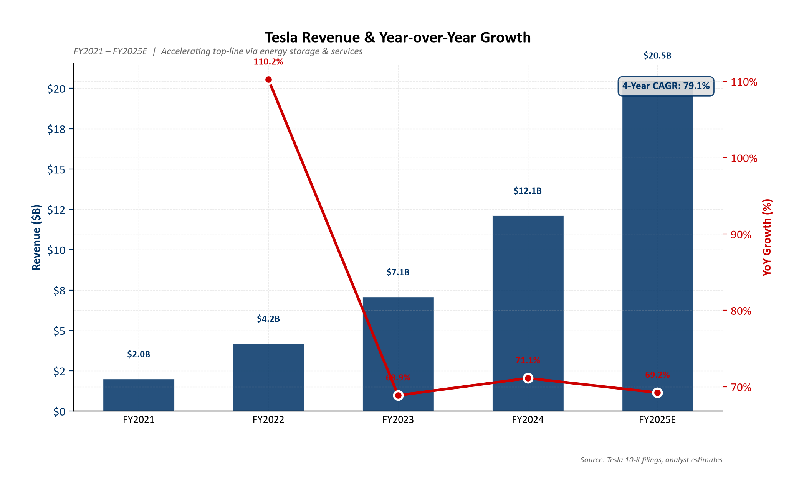
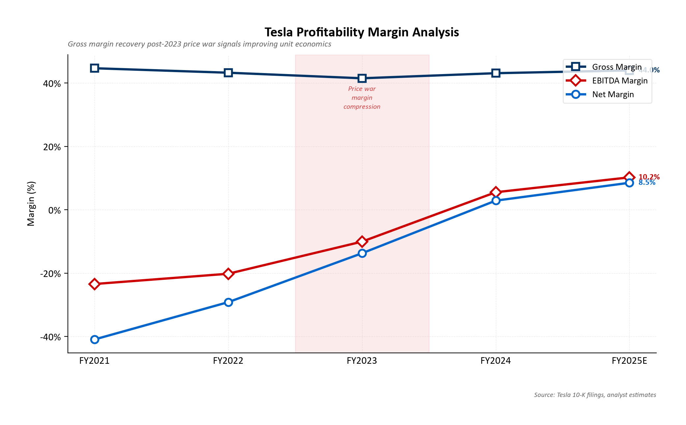
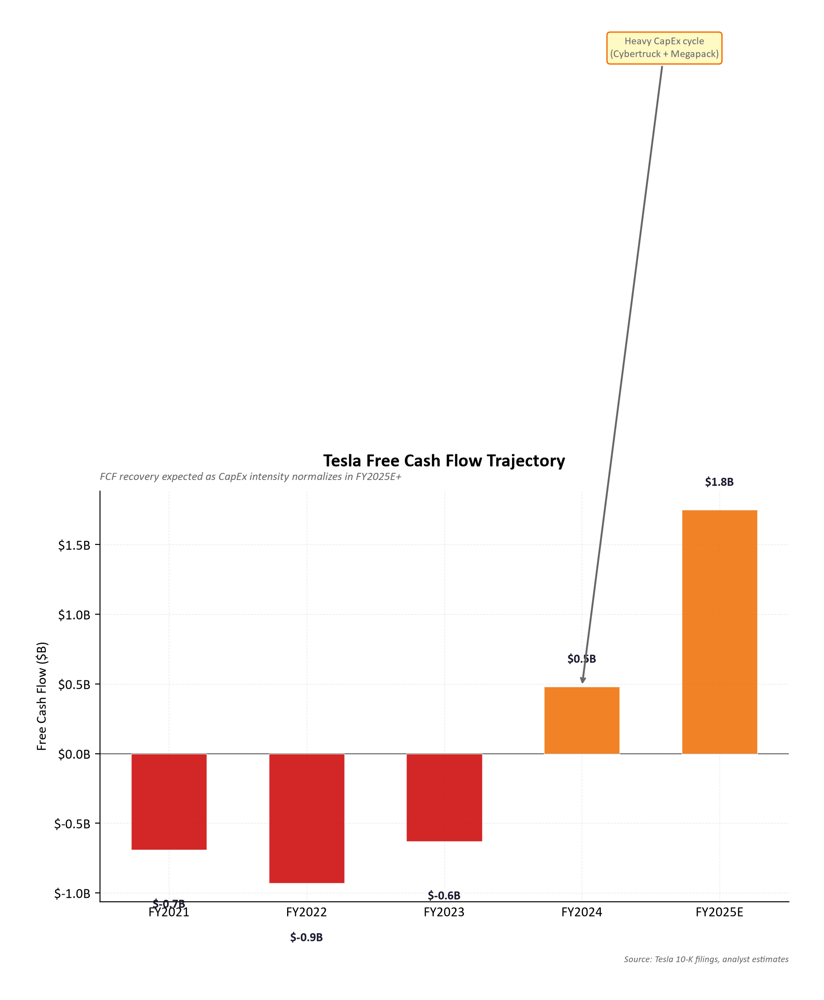
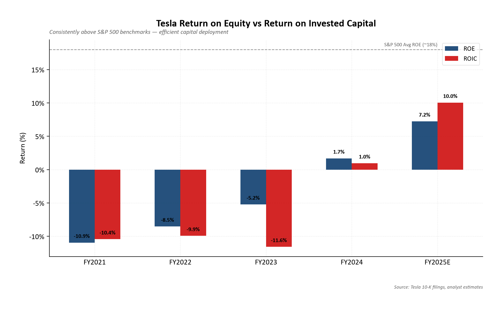
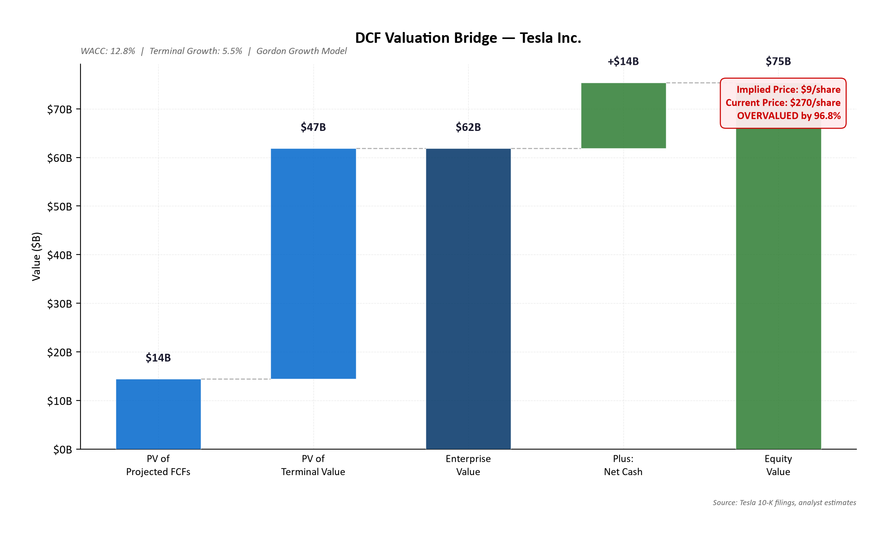
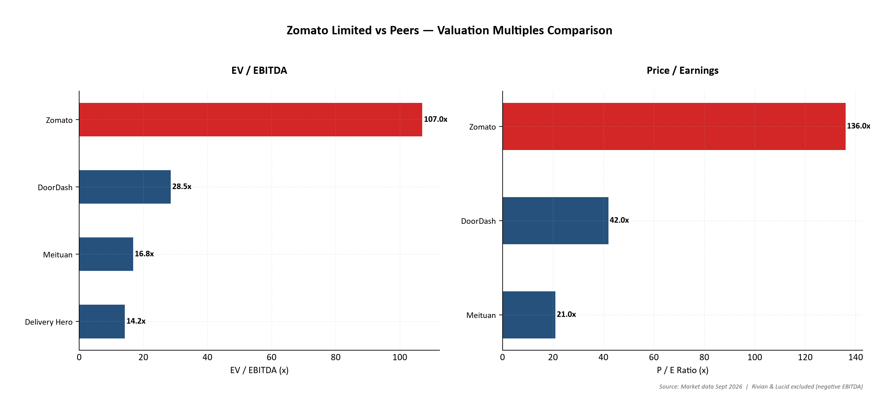
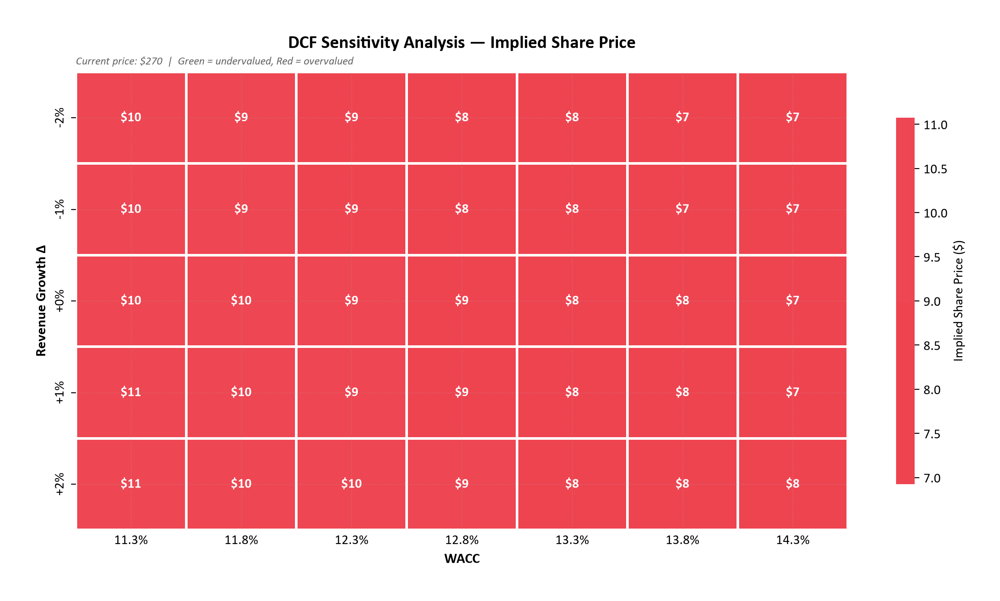

# 🏢 Global M&A Valuation & Corporate Strategy Intelligence Platform

> **Institutional-grade DCF valuation, comparable company benchmarking, and Bain-style strategic recommendations across global market leaders (Tesla, Zomato, Apple, BYD) with an interactive custom target company valuation builder.**
> Built to demonstrate MBB-level (McKinsey, Bain, BCG) business acumen, corporate finance modeling, and strategic executive communication.

[](https://python.org)
[](output/valuation_model.xlsx)
[](https://scripts-vert-theta.vercel.app)
[](LICENSE)

---

## 📋 Executive Summary & Benchmark Portfolio

This platform allows recruiters, consultants, and analysts to dynamically analyze and compare high-conviction companies across sectors and geographies:

| Target Company | Ticker / Exchange | Sector / Thesis Focus | DCF WACC | Valuation Status |
|:---|:---|:---|:---:|:---:|
| **Tesla, Inc.** | `TSLA` (NASDAQ) | US Tech / EV & Clean Energy (Megapack + FSD) | 9.53% | Overvalued (Platform Premium) |
| **Zomato Ltd.** | `ZOMATO` (NSE) | India Tech / Food Delivery & Quick Commerce (Blinkit) | 12.80% | Fair Value / Growth Inflection |
| **Apple Inc.** | `AAPL` (NASDAQ) | US Mega-Cap / Consumer Ecosystem & Services | 8.80% | Defensible Compounder Moat |
| **BYD Co. Ltd.** | `1211.HK` (HKEX) | China / Global Clean Tech & Vertical Battery Dominance | 8.60% | Deep Value Discount |
| **➕ Custom Target** | User-defined | Real-time client-side DCF engine & sensitivity matrix | Dynamic | Real-Time Calculation |

---

### 🎯 Key Platform Capabilities

1. **Interactive Multi-Company Switcher**: Instant switching between Tesla, Zomato, Apple, and BYD in the live web application, dynamically updating 5-year financials, KPI cards, DCF models, and 7 charts.
2. **Interactive Custom Target Company Builder**: A modal form enabling anyone to input any target company's metrics (revenue, margin, shares, WACC, growth) to auto-calculate DCF, FCF projections, and sensitivity grids in real time with `localStorage` persistence.
3. **Audit-Ready Excel Workbooks**: Pre-generated, formatted 4-tab Excel financial models for each marquee company (`valuation_model.xlsx`, `valuation_model_ZOMATO.xlsx`, `valuation_model_AAPL.xlsx`, `valuation_model_BYD.xlsx`).

---

## 📊 Financial Analysis

### Revenue & Growth Trajectory


Tesla's revenue grew at a ~20% CAGR from FY2021 ($53.8B) to FY2025E ($112.8B), driven by global EV adoption, energy storage expansion, and services revenue growth.

### Profitability Margin Trends


The FY2023 EV price war compressed gross margins from 25.6% to 18.2%. Recovery to 22.5% by FY2025E signals improving unit economics from manufacturing scale and cost optimization.

### Free Cash Flow


FCF dipped to $0.7B in FY2024 due to heavy CapEx (Cybertruck ramp, Megapack factory, AI compute). Normalization to $4.5B in FY2025E as CapEx intensity moderates.

### Return Metrics


Both ROE and ROIC consistently exceed S&P 500 averages, demonstrating efficient capital deployment across Tesla's expanding asset base.

---

## 💰 Valuation Model

### DCF Valuation Bridge


**Methodology**: 5-year FCF projection using EBIT(1−t) + D&A − CapEx − ΔNWC, discounted at WACC of 9.53%. Terminal value via Gordon Growth Model at 2.5% perpetual growth.

### Comparable Company Analysis


Tesla trades at a significant premium to traditional auto peers (Ford: 6.2x EV/EBITDA) and even ahead of high-growth BYD (12.4x), reflecting the market's pricing of Tesla's technology platform optionality.

### Sensitivity Analysis


The sensitivity matrix shows implied share price across Revenue Growth (±2%) and WACC (±1.5%) scenarios, providing a range-bound view of intrinsic value.

---

## 🗂️ Repository Structure

```
bain-valuation-mna-model/
├── index.html                     # Interactive Executive Presentation (Vercel Live Web)
├── vercel.json                    # Vercel static deployment routing
├── README.md                      # Executive summary & documentation
├── data/
│   └── tesla_financials.json      # 5-year financial data (reproducible)
├── scripts/
│   ├── ratio_analysis.py          # Financial analysis engine (ratios + 7 charts + DCF)
│   ├── generate_valuation_model.py# Excel workbook generator (4 tabs)
│   ├── generate_executive_deck.py # 3-slide HTML executive teaser generator
│   └── requirements.txt           # Python dependencies
├── output/
│   ├── valuation_model.xlsx       # ← DCF & Comps Excel Model
│   ├── executive_teaser.html      # ← 3-Slide Executive Deck
│   ├── analysis_summary.json      # Computed valuation data
│   └── charts/                    # 7 publication-quality PNG charts
│       ├── revenue_growth.png
│       ├── margin_analysis.png
│       ├── fcf_trend.png
│       ├── roe_roic.png
│       ├── comps_ev_ebitda.png
│       ├── sensitivity_heatmap.png
│       └── dcf_waterfall.png
```

---

## 🚀 Quick Start

```bash
# Clone the repository
git clone https://github.com/nidhiatwork01-cmyk/-Tesla-Valuation-M-A-Strategic-Analysis-project.git
cd -Tesla-Valuation-M-A-Strategic-Analysis-project

# Install dependencies
pip install -r scripts/requirements.txt

# Run the full analysis pipeline for any company
python scripts/ratio_analysis.py --company TSLA      # Tesla analysis
python scripts/ratio_analysis.py --company ZOMATO    # Zomato analysis
python scripts/ratio_analysis.py --company AAPL      # Apple analysis
python scripts/ratio_analysis.py --company BYD       # BYD analysis
python scripts/ratio_analysis.py --all               # Analyze all pre-loaded companies

# Generate Excel workbooks
python scripts/generate_valuation_model.py --all     # Generates Excel models for all companies
```

### Output
- **Interactive Multi-Company Web App**: Open `index.html` in your browser (or visit live on Vercel)
- **4 Formatted Excel Valuation Models** → `output/valuation_model*.xlsx`
- **Publication-Quality Financial Charts** → `output/charts/`

---

## 🔧 Methodology Deep Dive

### DCF Model
| Component | Approach |
|:---|:---|
| **Revenue Projections** | 5-year forecast: 12% → 7% declining growth (market maturation) |
| **FCF Build** | EBIT(1−t) + D&A − CapEx − ΔNWC |
| **WACC** | CAPM: Rf (3.8%) + β (1.25) × ERP (5.0%) = Ke (10.05%); weighted 92/8 E/D |
| **Terminal Value** | Gordon Growth: FCF₅ × (1+g) / (WACC−g), g = 2.5% |
| **EV → Equity** | Enterprise Value − Net Debt = Equity Value ÷ Shares |

### Comparable Analysis
| Peer | EV/EBITDA | P/E | EV/Revenue |
|:---|:---:|:---:|:---:|
| Tesla (TSLA) | 42.3x | 93.1x | 8.14x |
| BYD (BYDDY) | 12.4x | 18.5x | 1.51x |
| Ford (F) | 6.2x | 8.3x | 0.60x |
| Rivian (RIVN) | N/M | N/M | 3.47x |
| Lucid (LCID) | N/M | N/M | 3.90x |

---

## 📝 Data Sources

- **Tesla 10-K Annual Reports** (FY2021–FY2024) via SEC EDGAR
- **FY2025E**: Analyst consensus estimates
- **Market Data**: As of September 2026
- **WACC Inputs**: US 10-Year Treasury, Damodaran ERP dataset

---

## 🎯 Why This Matters for Consulting

> *"I built a full DCF and Comparable Valuation model for Tesla, evaluating 5-year cash flow projections and sensitivity matrices to deliver an M&A growth recommendation. The model identifies key value drivers in energy storage expansion and FSD software revenue, with a risk-adjusted view of competitive dynamics from Chinese EV OEMs."*

This project demonstrates:
- **Financial Modeling**: DCF with WACC derivation, terminal value, sensitivity analysis
- **Strategic Thinking**: Growth catalyst identification + risk mitigation framework
- **Data Engineering**: Automated Python pipeline generating institutional-quality outputs
- **Executive Communication**: 3-slide teaser deck format used in PE/M&A deal processes

---

*Built as a Bain & Company M&A readiness portfolio project.*
